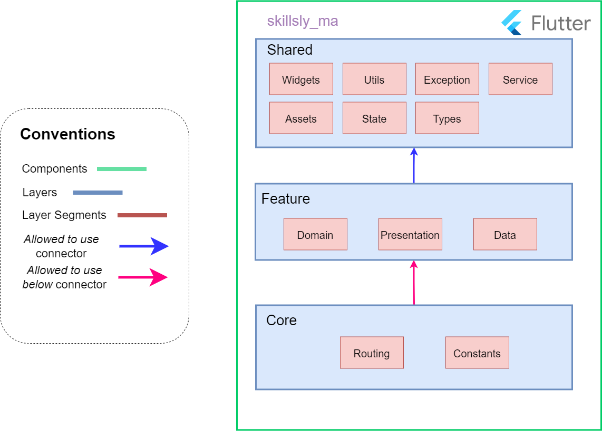

# Skillsly Mobile Frontend

Mobile component that provides a GUI for users to interact with Skillsly (Microservices architecture version).
This component consumes backend's GraphQL API through graphql-flutter library.

The layer structure of this component is the following:

**Core**: Includes the elements available in all layers and defined from the root of the application:  
- ***Routes*** **Segment**: Contains all the paths to the application screens.  
- ***Constants*** **Segment**: Contains the constants and classes used throughout the application.  

**Feature**: It includes each context, i.e. the separation of the business domain by functionalities, defines the following segments:    
- ***Domain*** **Segment**: Classes that encapsulate the business logic.    
- ***Presentation*** **Segment**: It defines the different widgets (components of the graphical user interface in Flutter), as well as their controllers (whose function is similar to the MVC analogs).  
- ***Data*** **Segment**: It encapsulates the API Gateway calls, using elements provided by graphql_flutter to use the GraphQL query language.   

**Shared**: It includes the common elements that can be used in different contexts, allowing the reduction of unnecessary repetition of elements in these contexts:   
- ***Widgets*** **Segment**: Contains the widgets used by the different contexts.    
- ***Utils*** **Segment**: Defines the utility elements (formatters, utility functions, etc.) available for different contexts.  
- ***Assets*** **Segment**: Contains all static elements used in widgets.  
- ***Exception*** **Segment**: Custom exceptions to distinguish between different types of errors.  
- ***Service*** **Segment**: Services available for the entire application.  
- ***State*** **Segment**: State accessible from any view.  
- ***Types*** **Segment**: Classes used throughout the application.  

A video showcasing the web and mobile components: [Skillsly Showcase](https://youtu.be/lTZk6qjDzSU)
